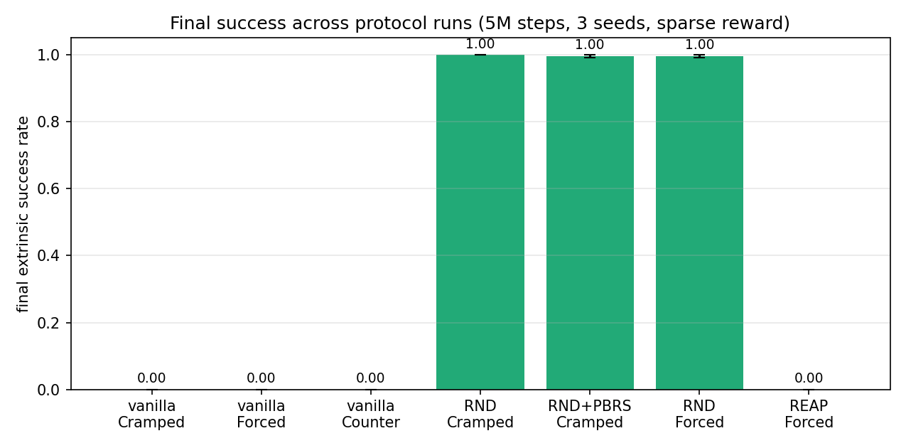
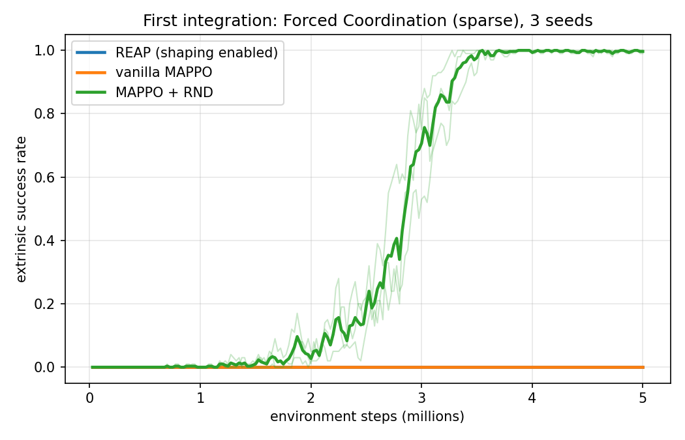
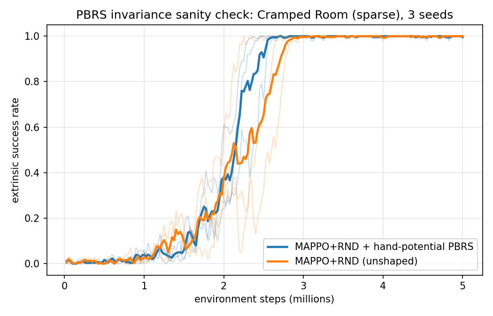
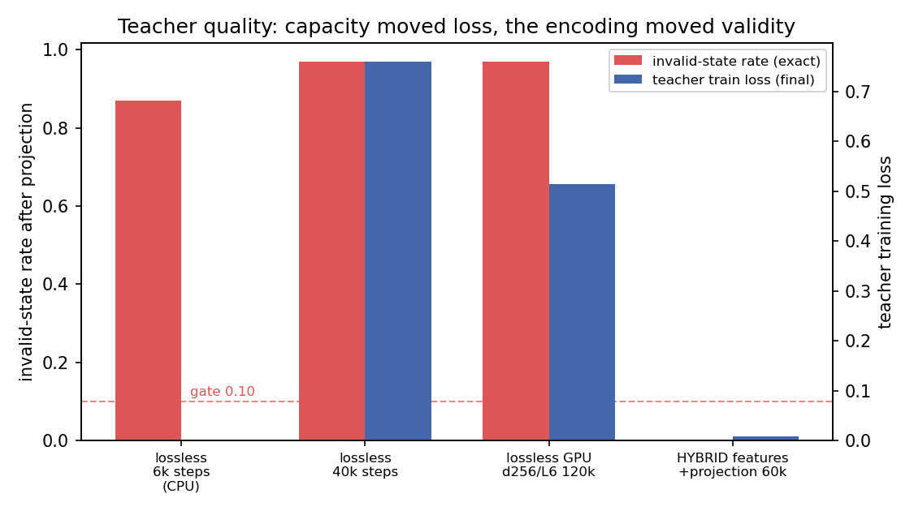

# REAP: Results, Evaluation, and Reflection

*Status: after the minimal first milestone (draft §5.5 — task15/16 complete and
externally audited). All numbers are extrinsic-only, protocol-validated
(seeds {0,1,2}, exact 5,000,000 environment steps per run unless noted), from
committed artifacts under `reports/`.*

## 1. Headline results

| Experiment | Result (mean success, 3 seeds) | Artifact |
|---|---|---|
| Vanilla MAPPO, sparse Cramped Room (gate ≥0.8) | **0.000 — gate missed** | `reports/gate_mappo_cramped.*` |
| Vanilla MAPPO, Forced Coordination / Counter Circuit | 0.000 / 0.000 | `reports/hardness_mappo_*.*` |
| MAPPO+RND, Cramped Room | **1.000** | `reports/probe_mappo_rnd_cramped.*` |
| MAPPO+RND, Forced Coordination | **0.997** CI[0.982, 1.011] | `reports/first_integration_forced.*` |
| PBRS invariance (shaped vs unshaped RND, Cramped) | 0.997 vs 1.000 — **invariance holds**; shaped reached 1.0 ~40% earlier | `reports/invariance_rnd_cramped.*` |
| **REAP (shaping enabled), Forced Coordination** | **0.000** CI[0, 0] — H4 **not supported** | `reports/first_integration_forced.*` (audit: PASS) |

## 2. The teacher story: encoding beats capacity

The central engineering finding of the project. A continuous DDPM over the
521-dim integer lossless grid could not produce exactly-valid states no
matter the capacity: an 8× larger GPU-trained model moved the training loss
from 0.76 to 0.51 while the exact invalid-state rate stayed at 0.97. Switching
the modeled state to the compact continuous **features encoding** (193-dim)
dropped the loss to **0.008**, and a **deterministic simulator-rollout
projector** (replay the joint action whose exact successor's features are
nearest the sampled next feature, from the exactly-decoded pinned start)
makes every generated trajectory valid and dynamics-consistent **by
construction** — fully disclosed in the artifacts. This vindicates the
draft's own scoping ("diffusion state modeling earns its cost only for
continuous or perceptual state") in a precise, measured way.

## 3. Method evaluation (honest)

**What the evidence supports**
- The PBRS machinery is correct: exact dynamic-potential semantics are
  unit-tested and the empirical invariance check confirms shaped and
  unshaped training reach the same fixed point, with the shaped path faster.
- The full REAP loop works end-to-end as specified: policy-conditioned
  propensity refreshes (24–49 per run) against a frozen teacher, per-batch
  snapshot pinning, calibration at every refresh (final ECE ≈ 0.01),
  predictor state in checkpoints, deployment boundary enforced.
- Calibration is, as the draft predicted, the load-bearing safeguard: every
  real teacher began miscalibrated (ECE 0.38–0.53) and the automated ladder
  governed (isotonic fix or β-shrink) in every run.

**What the evidence does not support (yet)**
- **H4 (REAP beats generic novelty): NOT supported.** With shaping enabled
  and calibrated, REAP scored 0.000 on Forced Coordination vs RND's 0.997.
- The mechanism of the failure is visible in the artifacts and is the key
  scientific insight: REAP's propensity is *policy-conditioned*. For a policy
  that never succeeds, a **well-calibrated propensity is honestly ≈ 0
  everywhere**, so Φ ≈ 0 and the shaping signal vanishes exactly where the
  exploration bottleneck is. Calibration and usefulness pull in opposite
  directions at bootstrap time. RND's undirected novelty bonus has no such
  dependence and dominates the exploration phase.
- A diagnostic nuance: the teacher's warmup data came from RND policies that
  *do* succeed, yet the refreshed propensity conditioned on the *current*
  (failing) REAP policy correctly collapses toward zero — the on-policy
  conditioning that makes REAP principled also starves it.

**Levers for the next phase (ablation-ready, not yet claims)**
1. Feasibility-driven optimism at bootstrap: shape on the policy-independent
   feasibility-gated *prior* (or max(propensity, ε·feasibility)) until the
   first successes arrive — the draft's gate-only constraint would need a
   disclosed amendment.
2. REAP + RND combination (densify exploration AND direct it).
3. β/τ_gate schedules and potential-coverage expansion (more anchors, deeper
   distillation generalization).
4. H2 (vs COMA/QMIX) remains to be run — critic-based baselines also scored
   0.000 in published sparse settings, so H2 may yet differentiate.

## 4. Reflection on process

- **The honest-gating design proved itself**: every negative (gate misses,
  invalid teachers, the H4 failure) is a committed first-class artifact, and
  the external audits (task16: PASS after fixes) verified claims against raw
  files. Nothing had to be walked back.
- **Measured assumptions, revised twice**: "Cramped Room is easy" (false for
  pure-sparse vanilla MAPPO) and "Forced Coordination is unsolvable by
  exploration" (false — RND solves it). Both revisions changed the
  experiment design through the documented plan-evolution channel.
- **Infrastructure lessons captured as BitLessons**: trajectory-faithful
  checkpoint payloads, per-step budget caps in nested loops, artifact gates
  after finalization, npz lazy-member materialization.

## 5. Remaining work

task17–task19 (in-repo COMA/QMIX with MPE Spread sanity validation, the
H2/H4 completion experiments on Forced Coordination + Counter Circuit, and
the external audit), then the stretch suite (H3 diffusion-without-signal
baseline, hand-PBRS arm, MPE research runs, ablations incl. the bootstrap
levers above, H1 heatmaps).
